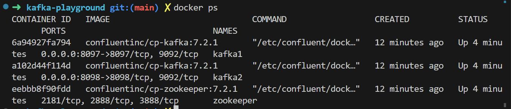
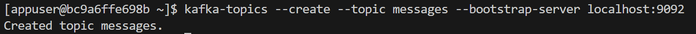
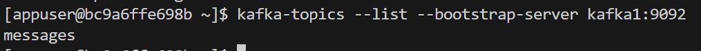
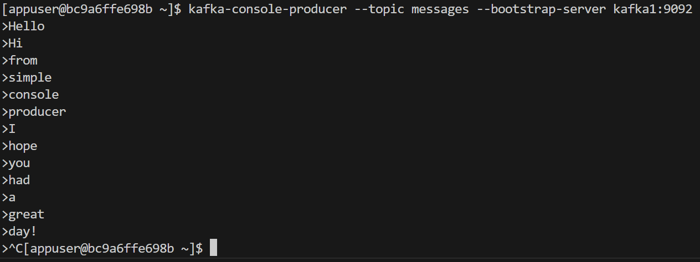
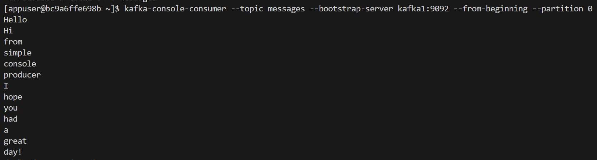
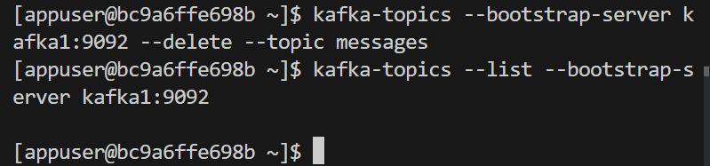

## Overview

This document describes most basic cli commands for two popular streaming brokers - Kafka and Redpanda.

## Kafka

### Prerequisites

1. `docker-compose up`
2. `docker ps`

3. `docker-compose exec kafka1 bash` - to start using kafka cli

### Creating a topic

`kafka-topics --create --topic messages --bootstrap-server localhost:8092 -
-replication-factor 1 --partitions 1`

### Listing all topics

`kafka-topics --list --bootstrap-server kafka1:9092`

### Sending messages

`kafka-console-producer --topic messages --bootstrap-server kafka1:9092`

### Receiving messages

`kafka-console-consumer --topic messages --bootstrap-server kafka1:9092 --from-beginning --partition 0`

### Deleting the topic

`kafka-topics --bootstrap-server k
afka1:9092 --delete --topic messages`

